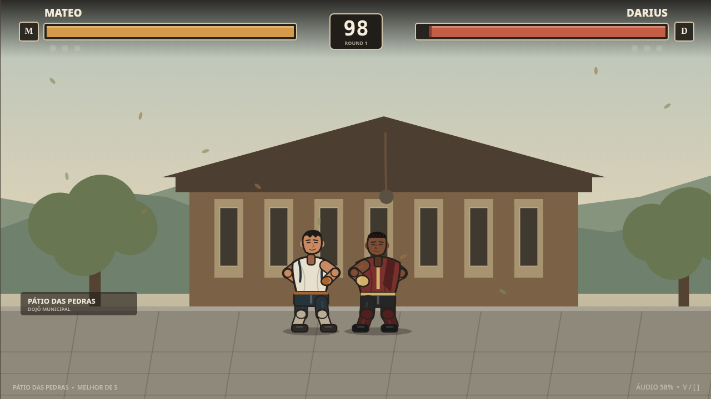

# Final Bell — Fighting Game v3

**Final Bell v3** evolui a vertical slice anterior sem substituir o núcleo que tornou o combate responsivo. A mesma simulação de `Fighter` + `CombatSystem` + `RoundManager` continua responsável por movimento, commitment windows, hitboxes/hurtboxes, hit stop, hit stun, knockback, block, combos, câmera e rounds; a v3 profissionaliza as camadas ao redor dela.



## O que entrou na v3

- **4 lutadores jogáveis** com configurações próprias, três skins cada e perfis visuais distintos.
- **Character Select** para dois jogadores.
- Personagens visualmente maiores, com câmera/escala sem alterar as caixas físicas por acidente.
- Alternância corporal determinística em sequências — por exemplo `Light -> Light -> Heavy` troca a variante do membro em vez de repetir de forma artificial.
- Balanceamento anti-infinite: damage scaling, hit-stun decay, pushback crescente, recuperação defensiva em combos longos e hard combo limit.
- Especiais por comandos clássicos, projéteis, super meter e finalizações arcade não gráficas.
- SFX em camadas para golpes, especiais, projéteis, super e finalização, com variações para evitar repetição.
- Controle virtual touch para lutas online mobile e navegação por toque nos menus.
- Cues de música original/procedural para menu, character select, luta, vitória e tournament.
- **Local Fight** preservado para dois jogadores no mesmo teclado.
- **Online Fight 1v1** via WebSocket e códigos privados.
- Lobby com nome, fighter, READY, host, conexão e ping.
- Reconnect, timeout/forfeit e host migration.
- **Tournament Room** single elimination para até 4 ou 8 jogadores, bracket e campeão.
- Settings persistidos: master/music/SFX, screen shake, fullscreen, render scale, controles e touch online.
- Testes de combate, all-vs-all do roster e smoke tests de rede com sockets reais.

## Tecnologias

- TypeScript `strict`;
- HTML5 Canvas 2D;
- Web Audio API;
- WebSocket nativo;
- Node.js para dev/build/servidor multiplayer;
- loop fixed-step de 60 FPS derivado de Kontra.js e vendorizado;
- sem React e sem framework de UI.

## Requisitos

- Node.js 20+; Node.js 22 recomendado.
- Navegador moderno com Canvas, Web Audio e WebSocket.

## Instalar e executar

```bash
npm install
npm run dev
```

Por padrão, abre em:

```text
http://127.0.0.1:4173
```

`npm run dev` gera `dist/`, serve o frontend e sobe o WebSocket em `/ws` na mesma porta.

### Build

```bash
npm run build
```

### Servidor de produção

```bash
npm run build
npm start
```

Pode-se definir `PORT` no ambiente. Para internet pública, use HTTPS/WSS por um reverse proxy.

## Validação

```bash
npm run typecheck
npm test
npm run validate
```

A suíte valida, entre outros pontos:

- input simultâneo local;
- jump/bounds/pushboxes;
- light/heavy/block;
- hitbox/hurtbox;
- hit stop/hit stun/knockback;
- cancel e combo;
- rounds/pause/restart;
- 4 lutadores únicos com três skins e kits especiais completos;
- todos contra todos para alcance base;
- alternância determinística dos golpes;
- damage scaling/hit-stun decay/pushback/hard combo end;
- sala privada;
- READY;
- relay de input;
- reconexão e recuperação de sessão;
- host migration;
- timeout/forfeit;
- bracket single elimination e campeão.

## Menu

```text
PLAY
  LOCAL FIGHT
  ONLINE FIGHT
  TOURNAMENT

CHARACTERS
CONTROLS
SETTINGS
```

## Controles locais

### Preset Classic

| Ação | P1 | P2 |
|---|---|---|
| Esquerda | `A` | `←` |
| Direita | `D` | `→` |
| Pular | `W` | `↑` |
| Agachar | `S` | `↓` |
| Ataque fraco | `F` | `K` |
| Ataque forte | `G` | `L` |
| Defender | `R` | `O` |

### Preset Ghosting Safe

| Ação | P1 | P2 |
|---|---|---|
| Esquerda | `A` | `J` |
| Direita | `D` | `L` |
| Pular | `W` | `I` |
| Agachar | `S` | `K` |
| Ataque fraco | `C` | `N` |
| Ataque forte | `V` | `M` |
| Defender | `B` | `,` |

No online, cada computador controla somente o próprio personagem usando o conjunto P1 do preset escolhido.

### Comandos especiais e mobile

| Ação | Comando relativo ao adversário |
|---|---|
| Projétil | `↓ ↘ → + ataque fraco` |
| Especial anti-aéreo | `→ ↓ ↘ + ataque forte` |
| Super (meter cheio) | `↓ ↘ → ↓ ↘ → + ataque forte` |
| Finalização no KO decisivo | `↓ ↘ → + defesa` |

Os movimentos direcionais possuem uma janela tolerante de 900 ms, adequada para teclado e controles touch.

Em celulares, partidas online exibem um direcional touch de oito direções e botões de ataque/defesa. Menus, lobby, READY, skins e campos de sala aceitam toque e teclado virtual. O modo local mobile continua exigindo teclado/outro dispositivo, pois o controle virtual é destinado ao lutador online local.

## Roster

| Fighter | Arquétipo | Destaque |
|---|---|---|
| Mateo | Balanced | Base de referência do combate original. |
| Darius | Heavy/pressure | Mais peso e presença curta. |
| Nox | Rushdown | Avanço agressivo com leitura direta. |
| Aldric | Range | Alcance maior e neutral mais disciplinado. |

A configuração fica em `src/characters/roster.ts`, enquanto os sprites ficam em `src/characters/spriteProfiles.ts`. O `CombatSystem` não contém condicionais específicas por personagem.

## Como adicionar um novo personagem

1. Crie/derive um `FighterDefinition`.
2. Configure vida, velocidade, air control, jump force, gravity/weight e body.
3. Configure `light`, `heavy`, `crouchLight` e `airLight`, com startup/active/recovery/hit stun/block stun/knockback/hitbox.
4. Adicione um `FighterSpriteDefinition` com clips e licença/origem.
5. Insira a definição no `ROSTER`.
6. Rode `npm run validate`.

Não é necessário editar `CombatSystem` para um novo lutador convencional.

## Combate e anti-infinite

Os primeiros golpes preservam o comportamento-base da v2. Em sequências longas, `src/config/combatBalance.ts` aplica progressivamente:

- `comboDamageScaling`;
- `hitStunDecay`;
- `pushbackScaling`;
- bônus de recuperação defensiva a partir de um número de hits;
- limite máximo de combo que força separação e encerra o estado da sequência.

Isso evita loops de light attack sem remover a recompensa por confirmar combos curtos.

## Multiplayer

O online transmite **inputs**, não posições. A luta continua consumindo `InputSource` e não sabe que existe um WebSocket.

A v3 usa input delay + predição simples. Rollback completo ainda não está implementado, mas a separação simulação/input/render/network foi construída para permitir essa evolução.

Consulte **[`MULTIPLAYER.md`](MULTIPLAYER.md)** para protocolo, reconnect, salas, tournament e roadmap de rollback.

## Estrutura

```text
src/
├── characters/
│   ├── Fighter.ts
│   ├── FighterRenderer.ts          # fallback procedural
│   ├── SpriteFighterRenderer.ts    # renderer de sprite
│   ├── SpriteAssetManager.ts
│   ├── roster.ts
│   └── spriteProfiles.ts
├── combat/
│   ├── CombatSystem.ts
│   └── ComboSystem.ts
├── config/
│   ├── combatBalance.ts
│   ├── controls.ts
│   └── gameConfig.ts
├── network/
│   ├── NetworkClient.ts
│   ├── NetworkInputSource.ts
│   └── protocol.ts
├── scenes/
│   ├── MainMenuScene.ts
│   ├── MenuScene.ts
│   ├── CharacterSelectScene.ts
│   ├── FightScene.ts
│   ├── OnlineEntryScene.ts
│   ├── OnlineLobbyScene.ts
│   └── SettingsScene.ts
├── stages/
├── systems/
├── ui/
└── main.ts

server/
└── multiplayer.mjs

scripts/
├── build.mjs
├── runtime-smoke.mjs
├── vendor-assets.mjs
├── dev.mjs
├── serve.mjs
├── smoke.mjs
├── network-smoke.mjs
└── validate.mjs
```

## Assets e licenças

Veja [`ASSETS.md`](ASSETS.md) e [`THIRD_PARTY_NOTICES.md`](THIRD_PARTY_NOTICES.md).

Os profiles de sprite agora são **local-first**: procuram primeiro `public/assets/fighters/...`, depois usam um mirror fixado em commit imutável e, por último, caem no renderer procedural. Para vendorizar os PNGs automaticamente em uma máquina com acesso à internet:

```bash
npm run assets:vendor
npm run build
```

O comando valida a assinatura PNG antes de gravar os arquivos. Neste ambiente de geração, DNS externo do terminal está bloqueado, então os binários não puderam ser incorporados automaticamente; a lógica local-first e o fallback remoto/procedural permanecem funcionais.

## Limitações atuais

- netcode usa input delay/predição; rollback completo ainda é roadmap;
- servidor mantém salas em memória; reinício perde salas/torneios;
- não há conta/login nem persistência de ranking;
- spectator acompanha lobby/bracket, mas não vê a luta ao vivo;
- resultado online é reportado pelos clientes, sem servidor autoritativo;
- se `npm run assets:vendor` ainda não tiver sido executado, os sprites profissionais usam os mirrors fixados; offline cai para o renderer procedural;
- alguns packs não possuem clips dedicados para block/jump, portanto são adaptadas poses existentes;
- ainda não há gamepad, throws, command specials ou training mode.

## Próximos passos para comercialização

- executar `npm run assets:vendor` e versionar os PNGs resultantes para distribuição 100% offline;
- rollback + checksums de desync;
- gamepad/remapeamento completo;
- persistência de contas/salas/ranking;
- spectator por stream de inputs confirmados;
- training mode e frame-data overlay;
- throws, specials e super meter;
- matchmaking público e observabilidade do servidor.
